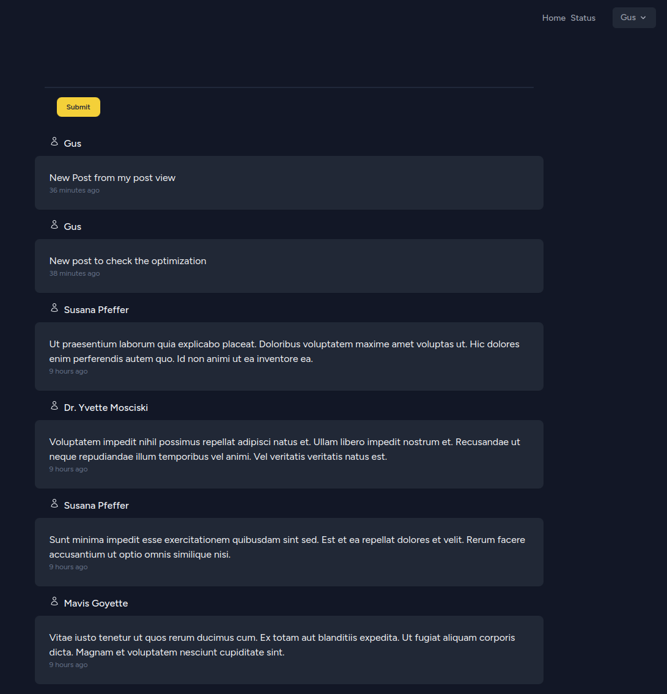
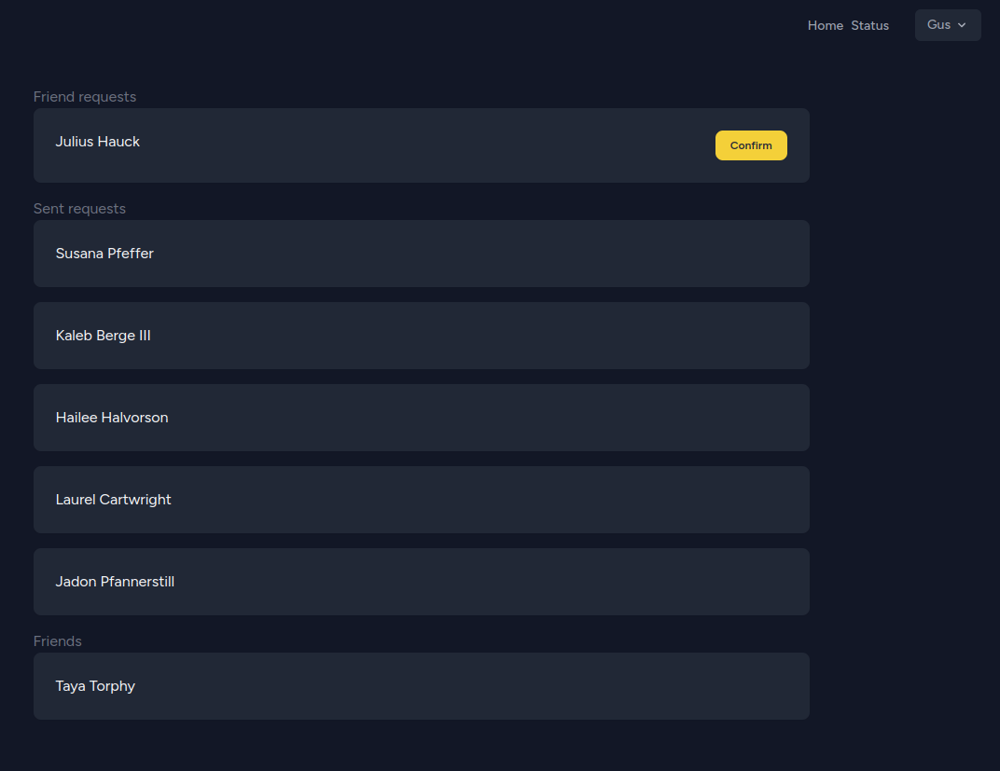
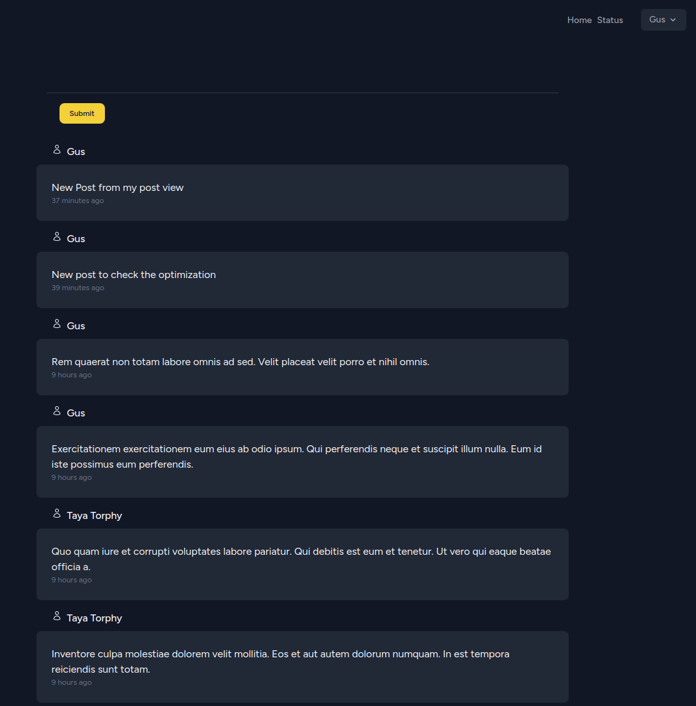

## Project Details

An interactive database system that allows users to create, view, and comment on content. It features a user-fiendly interface with a top menu providing access to:
- Home: the page for see the home feed
- Status: the page for managing social interactions
- Mis Posts: the page for viewing user-generated posts

## Home

## Status

## My Post

## License

The Laravel framework is open-sourced software licensed under the [MIT license](https://opensource.org/licenses/MIT).
